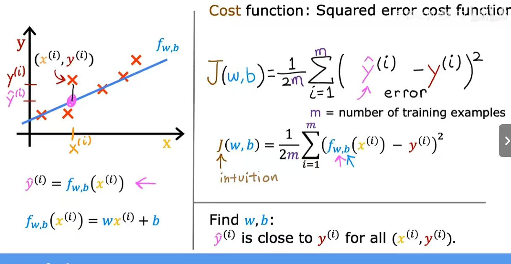
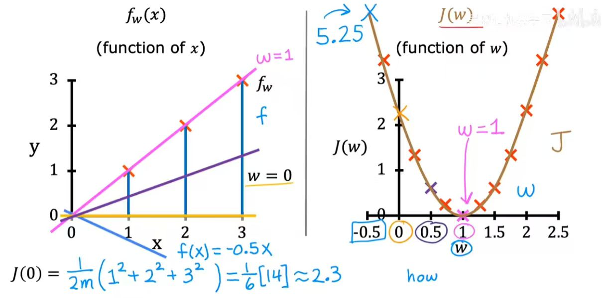

25/12/14

今天是第一天，主要是想做一些基本的规划。目前打算从数学、数据结构、机器学习三个方向推进了。所以12月末可能会报考二级C语言，下学期参加数学竞赛吧。如果有机会我还是想参加ACM、kaggle这些比赛，结识更多的人吧！;(

1. umm 今天学习了监督学习和非监督学习的基本介绍。监督学习：回归和分类。非监督学习：聚类、异常检测和降维。

2. 还安装了ANACONDA 学习了里面的jupyter notes，真的很方便

3. 看了鸢尾花项目...还没搞懂

4. 安装并尝试使用obsidian写学习笔记，学习markdown语法。

5. 开始学习了C语言，打算学习数据结构与算法

---
25/12/15

今天学习时间为2h，主要是了解了一些专有名词，涉及到的数学知识还是很简单的，主要学了线性回归模型和成本函数。等下还是打算去实践些项目玩玩。

1. 训练集是学习数据特征x与目标值y映射关系的样本集合。
2. cost function成本函数也就是方差，越小拟合效果越好。注意具体公式
3. 这里引入了一个反应成本函数和自变量关系的函数，一般来说二维的（理想化把y=kx+b的b当成0）就是U型，三维的肯定就是立体的碗型。